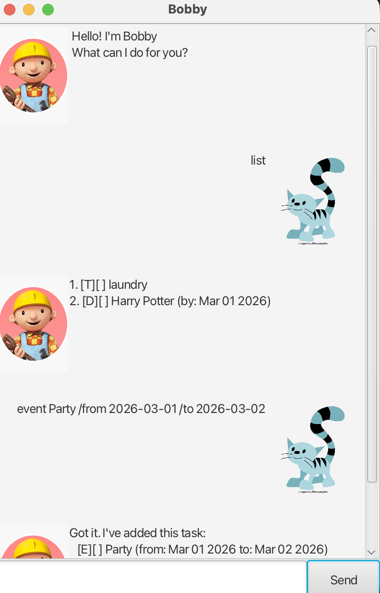

# Bobby User Guide

Bobby is a simple task management chatbot that helps you keep track of todos, deadlines, and events using natural text commands.

Bobby is designed for fast keyboard-based interaction — no mouse needed.

---

## Features

### Adding a Todo

Adds a basic task without any date or time.

**Command Format:**
`todo DESCRIPTION`

**Example:**
`todo Read CS2040S notes`

**Expected Outcome:**
A new todo task is added to your list.

---

### Adding a Deadline

Adds a task that must be completed by a specific date.

**Command Format:**
`deadline DESCRIPTION /by YYYY-MM-DD`

**Example:**
`deadline Submit assignment /by 2026-03-01`

**Expected Outcome:**
A new deadline task is added with the specified due date.

---

### Adding an Event

Adds a task that occurs within a time range.

**Command Format:**
`event DESCRIPTION /from YYYY-MM-DD /to YYYY-MM-DD`

**Example:**
`event Project meeting /from 2026-03-01 /to 2026-03-02`

**Expected Outcome:**
A new event task is added with start and end dates.

---

### Listing Tasks

Displays all tasks currently stored.

**Command Format:**
`list`

---

### Marking a Task as Done

Marks a task as completed.

**Command Format:**
`mark INDEX`

**Example:**
`mark 1`

---

### Marking a Task as Not Done

Marks a task as incomplete.

**Command Format:**
`unmark INDEX`

**Example:**
`unmark 1`

---

### Deleting a Task

Removes a task from the list.

**Command Format:**
`delete INDEX`

**Example:**
`delete 2`

---

### Finding Tasks

Finds tasks containing keywords.

**Command Format:**
`find KEYWORDS`

**Example:**
`find meeting`

---

### Exiting Bobby

Closes the application.

**Command Format:**
`bye`

---

## Error Handling

Bobby handles common user mistakes gracefully:

- Invalid commands → Helpful error message
- Invalid task number → Clear correction hint
- Missing arguments → Usage guidance
- Missing data file → Starts with empty list

---

## Notes

- Dates must follow the format: `YYYY-MM-DD`
- Task numbering starts from **1**

---

## Credits

This project was initially based on the SE-EDU Duke project template and adapted for learning purposes.